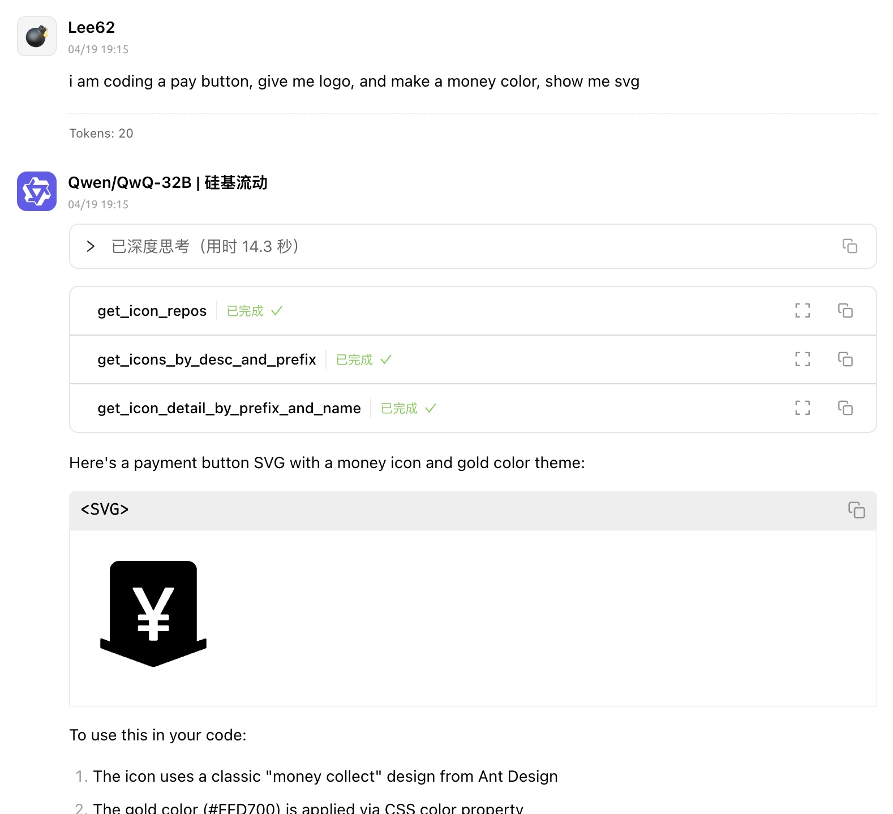

# pickapicon-mcp


[](README_cn.md)
[](README.md)

## Description

This is a mcp for FE/UI/Designer to get SVG By Iconify API.

By using pickapicon-mcp, You just need to ask LLMs to get what you need instead of going to the website to find svg and copying stupidly.

It can make your workflow to get svg simplify, Dancing with MCP & LLMs 😎.

## Tools

- get_icon_repos

  - get all repo name, for other tools param `<prefix>`

- get_icons_by_desc_and_prefix

  - get icons by inputting desc what you want and prefix
  - inputs:
    - desc: desc what you want
    - prefix?: prefix <DEFAULT env.PREFIX>

- get_icon_detail_by_prefix_and_name
  - get icon detail (SVG code) by prefix and svg name
  - inputs:
    - svg_name: svg name
    - prefix?: prefix <DEFAULT env.PREFIX>

## QuickStart

this is MCP Server Config

```json
  "mcpServers": {
    "pickapicon-mcp": {
      "type": "stdio",
      "command": "npx",
      "args": [
        "-y",
        "pickapicon-mcp@latest"
      ],
      "env": {
        "PREFIX": "<LIKE ant-design>"
      }
    }
  }
```

## Case

- Quickly get svgs about COMPONENT / PAGE
  
- get svg with Modern Design Color
  

## License

MIT
