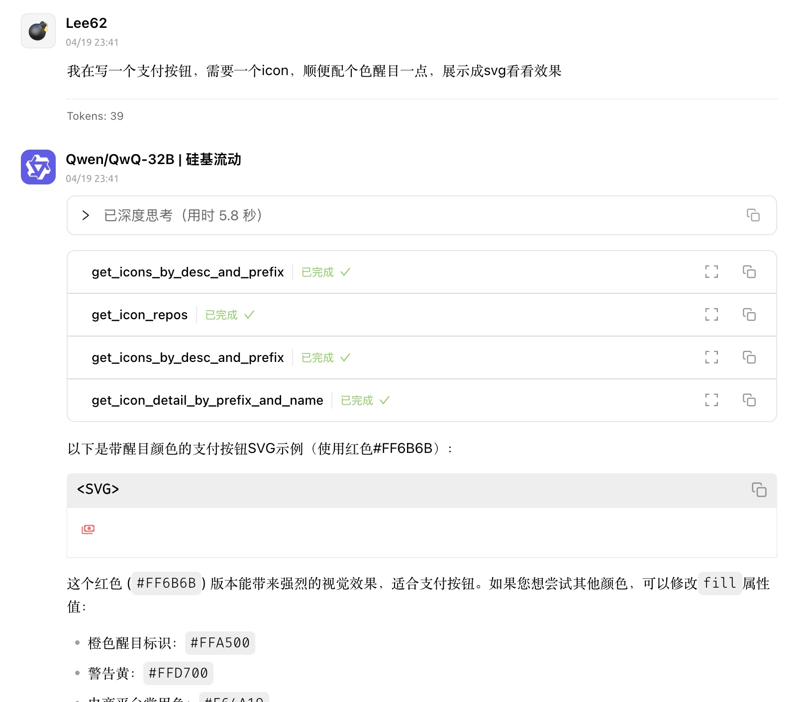

# pickapicon-mcp


[](README_cn.md)
[](README.md)

## Description

这是一个面向前端/UI/设计者的图标检索 MCP，通过 Iconify API 获取 SVG 图标。

使用 pickapicon-mcp 后，您只需通过自然语言询问 LLM 即可快速获取所需图标，无需呆呆的手动前往官网查找复制 SVG 代码。

通过结合 MCP 与 LLM，您的图标获取工作流将变得更简洁高效，开启开发新体验 😎.

## Tools

- 获取所有图标库名称（get_icon_repos）

  - 功能：获取所有图标库的名称列表，用于其他工具的`<prefix>`参数

- 通过描述和前缀搜索图标（get_icons_by_desc_and_prefix）

  - 功能：根据输入的描述词和图标库前缀，检索匹配图标
  - 输入参数：
    - `desc`: 需要检索的图标描述词（必填）
    - `prefix?`: 图标库前缀（可选，默认使用环境变量`PREFIX`）

- 获取图标详细信息（get_icon_detail_by_prefix_and_name）
  - 功能：通过前缀和图标名称获取具体的 SVG 代码
  - 输入参数：
    - `svg_name`: 目标图标名称（必填）
    - `prefix?`: 图标库前缀（可选，默认使用环境变量`PREFIX`）

## QuickStart

在您的 MCP 服务器配置中添加以下配置：

```json
  "mcpServers": {
    "pickapicon-mcp": {
      "type": "stdio",
      "command": "npx",
      "args": [
        "-y",
        "pickapicon-mcp@latest"
      ],
      "env": {
        "PREFIX": "<prefix .like ant-design>"
      }
    }
  }
```

## Case

- 快速获取组件/页面图标
  
- 获取现代设计风格配色的图标
  

## License

MIT
